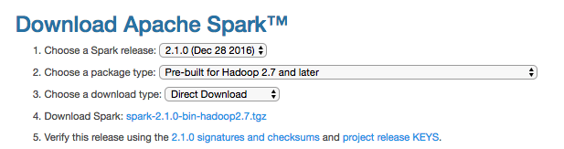

## Before doing anything [Requirements]

**Step 1: AWS Account Setup** Before installing Spark on your computer, be sure to [set up an Amazon Web Services account](setup_aws.md). If you already have an AWS account, make sure that you can log into the [AWS Console](https://console.aws.amazon.com) with your username and password.

 * [AWS Setup Instructions](setup_aws.md)

**Step 2: Software Installation** Before you dive into these installation instructions, you need to have some software installed. Here's a table of all the software you need to install, plus the online tutorials to do so.

### Requirements for Mac

| Name | Description | Installation Guide |
| :-- | :-- | :-- |
| Brew | The package installation soft for mac. Very helpful for this installation and in life in general. | [brew install](http://brew.sh/) |
| Anaconda | A distribution of python, with packaged modules and libraries. **Note: we recommend installing Anaconda 2 (for python 2.7)** | [anaconda install](https://docs.continuum.io/anaconda/install) |
| JDK 8 | Java Development Kit, used in both Hadoop and Spark. | just use `brew cask install java` |

### Requirements for Linux

| Name | Description | Installation Guide |
| :-- | :-- | :-- |
| Anaconda | A distribution of python, with packaged modules and libraries. **Note: we recommend installing Anaconda 2 (for python 2.7)** | [anaconda install](https://docs.continuum.io/anaconda/install) |
| JDK 8 | Java Development Kit, used in both Hadoop and Spark. | [install for linux](https://docs.oracle.com/javase/8/docs/technotes/guides/install/linux_jdk.html) |


# 1. Spark / PySpark Installation

We are going to install Spark+Hadoop. Use the Part that corresponds to your configuration:
- 1.1. Installing Spark+Hadoop on Mac with no prior installation
- 1.2. Installing Spark+Hadoop on Linux with no prior installation
- 1.3. Use Spark+Hadoop from a prior installation

We'll do most of these steps from the command line. So, open a terminal and jump in !

**NOTE**: If you would prefer to jump right into using spark you can use the `spark-install.sh` script provided in this repo which will automatically perform the installation and set any necessary environment variables for you.  This script will install `spark-2.1.0-bin-hadoop2.7`.

## 1.1. Installing Spark+Hadoop on MAC with no prior installation (using brew)

Be sure you have brew updated before starting: use `brew update` to update brew and brew packages to their last version.

1\. Use `brew install hadoop` to install Hadoop (version 2.7.3 as of Jan 2017)

2\. Check the hadoop installation directory by using the command:

```bash
brew info hadoop
```

3\. Use `brew install apache-spark` to install Spark (version 2.1.0 as of Jan 2017)

4\. Check the installation directory by using the command:

```
brew info apache-spark
```

5\. You're done ! You can now go to the section 2 for setting up your environment and run your Spark scripts.


## 1.2. Installing Spark+Hadoop on Linux with no prior installation

1\. Go to [Apache Spark Download page](http://spark.apache.org/downloads.html). Choose the latest Spark release (2.1.0), and the package type "Pre-built for Hadoop 2.7 and later". Click on the link "Download Spark" to get the `tgz` package of the latest Spark release. On Jan 2017 this file was `spark-2.1.0-bin-hadoop2.7.tgz` so we will be using that in the rest of these guidelines but feel free to adapt to your version.

> 

2\. Uncompress that file into `/usr/local` by typing:

```
sudo tar xvzf spark-2.1.0-bin-hadoop2.7.tgz -C /usr/local/
```

3\. Create a shorter symlink of the directory that was just created using:

```
sudo ln -s /usr/local/spark-2.1.0-bin-hadoop2.7 /usr/local/spark
```

4\. Go to [Apache Hadoop Download page](http://hadoop.apache.org/releases.html#Download). On the table above, click on the latest version below 3 (2.7.3 as of Nov 2016). Click as to download the *binary* version `tar.gz` archive, choose a mirror and download the file unto your computer.

5\. Uncompress that file into `/usr/local` by typing:

```
sudo tar xvzf /path_to_file/hadoop-2.7.3.tar.gz -C /usr/local/
```

6\. Create a shorter symlink of this directory using:

```
sudo ln -s /usr/local/hadoop-2.7.3 /usr/local/hadoop
```


## 1.3. Using a prior installation of Spark+Hadoop

We strongly recommend you update your installation to the must recent version of Spark. As of Jan 2017 we used Spark 2.1.0 and Hadoop 2.7.3.

If you want to use another version there, all you have to do is to locate your installation directories for Spark and Hadoop, and use that in the next section 2.1 for setting up your environment.


# 2. Setting up your environment

## 2.1. Environment variables

To run Spark scripts you have to properly setup your shell environment: setting up environment variables, verifying your AWS credentials, etc.

1\. Edit your `~/.bash_profile` to add/edit the following lines depending on your configuration. This addition will setup your environment variables `SPARK_HOME` and `HADOOP_HOME` to point out to the directories used to install Spark and Hadoop.

**For a Mac/Brew installation**, copy/paste the following lines into your `~/.bash_profile`:
```bash
export SPARK_HOME=`brew info apache-spark | grep /usr | tail -n 1 | cut -f 1 -d " "`/libexec
export PYTHONPATH=$SPARK_HOME/python:$PYTHONPATH

export HADOOP_HOME=`brew info hadoop | grep /usr | head -n 1 | cut -f 1 -d " "`/libexec
export LD_LIBRARY_PATH=$HADOOP_HOME/lib/native/:$LD_LIBRARY_PATH
```

**For the Linux installation described above**, copy/paste the following lines into your `~/.bash_profile`:
```bash
export SPARK_HOME=/usr/local/spark
export PYTHONPATH=$SPARK_HOME/python:$PYTHONPATH

export HADOOP_HOME=/usr/local/hadoop
export LD_LIBRARY_PATH=$HADOOP_HOME/lib/native/:$LD_LIBRARY_PATH
```

**For any other installation**, find what directories your Spark and Hadoop installation where, adapt the following lines to your configuration and put that into your `~/.bash_profile`:
```bash
export SPARK_HOME=###COMPLETE HERE###
export PYTHONPATH=$SPARK_HOME/python:$PYTHONPATH

export HADOOP_HOME=###COMPLETE HERE###
export LD_LIBRARY_PATH=$HADOOP_HOME/lib/native/:$LD_LIBRARY_PATH
```

While you're in `~/.bash_profile`, be sure to have two environment variables for your AWS keys. We'll use that in the assignments. Be sure you have the following lines set up (with the actual values of your AWS credentials):

```bash
export AWS_ACCESS_KEY_ID='put your access key here'
export AWS_SECRET_ACCESS_KEY='put your secret access key here'
```

**Note**: After any modification to your `.bash_profile`, for your terminal to take these changes into account, you need to run `source ~/.bash_profile` from the command line. They will be automatically taken into account next time you open a new terminal.

## 2.2. Python environment

1\. Back to the command line, install py4j using `pip install py4j`.

2\. To check if everything's ok, start an `ipython` console and type `import pyspark`. This will do nothing in practice, that's ok: **if it did not throw any error, then you are good to go.**


# 3. How to run Spark python scripts

## 3.1. How to run Spark/Python from a Jupyter Notebook

Running Spark from a jupyter notebook can require you to launch jupyter with a specific setup so that it connects seamlessly with the Spark Driver. We recommend you create a shell script `jupyspark.sh` designed specifically for doing that.

1\. Create a file called `jupyspark.sh` somewhere under your `$PATH`, or in a directory of your liking (I usually use a `scripts/` directory under my home directory). In this file, you'll copy/paste the following lines:

```bash
#!/bin/bash
export PYSPARK_DRIVER_PYTHON=jupyter
export PYSPARK_DRIVER_PYTHON_OPTS="notebook --NotebookApp.open_browser=True --NotebookApp.ip='localhost' --NotebookApp.port=8888"

${SPARK_HOME}/bin/pyspark \
--master local[4] \
--executor-memory 1G \
--driver-memory 1G \
--conf spark.sql.warehouse.dir="file:///tmp/spark-warehouse" \
--packages com.databricks:spark-csv_2.11:1.5.0 \
--packages com.amazonaws:aws-java-sdk-pom:1.10.34 \
--packages org.apache.hadoop:hadoop-aws:2.7.3
```


Save the file. Make it executable by doing `chmod 711 jupyspark.sh`. Now, whenever you want to launch a spark jupyter notebook run this script by typing `jupyspark.sh` in your terminal.

Here's how to read that script... Basically, we are going to use `pyspark` (an executable from your Spark installation) to run `jupyter` with a proper Spark context.

The first two lines :
```bash
export PYSPARK_DRIVER_PYTHON=jupyter
export PYSPARK_DRIVER_PYTHON_OPTS="notebook --NotebookApp.open_browser=True --NotebookApp.ip='localhost' --NotebookApp.port=8888"
```
will set up two environment variables for `pyspark` to execute `jupyter`.

Note: If you are installing Spark on a Virtual Machine and would like to access jupyter from your host browser, you should set the NotebookApp.ip flag to `--NotebookApp.ip='0.0.0.0'` so that your VM's jupyter server will accept external connections. You can then access jupyter notebook from the host machine on port 8888.

The next line:
```bash
${SPARK_HOME}/bin/pyspark \
```
is part of a multiline long command to run `pyspark` with all necessary packages and options.

The next 3 lines:
```bash
--master local[4] \
--executor-memory 1G \
--driver-memory 1G \
```
Set up the options for `pyspark` to execute locally, using all 4 cores of your computer and setting up the memory usage for Spark Driver and Executor.

The next line:
```bash
--conf spark.sql.warehouse.dir="file:///tmp/spark-warehouse" \
```
Is creating a directory to store Sparl SQL dataframes. This is non-necessary but has been solving a common error for loading and processing S3 data into Spark Dataframes.

The final 3 lines:
```bash
--packages com.databricks:spark-csv_2.11:1.5.0 \
--packages com.amazonaws:aws-java-sdk-pom:1.10.34 \
--packages org.apache.hadoop:hadoop-aws:2.7.3
```
add specific packages to `pyspark` to load. These packages are necessary to access AWS S3 repositories from Spark/Python and to read csv files.

**Note**: You can adapt these parameters to your own liking. See Spark page on [Submitting applications](http://spark.apache.org/docs/latest/submitting-applications.html) to tune these parameters.

2\. Now run this script. It will open a notebook home page in your browser. From there, create a new notebook and copy/pate the following commands in your notebook:

```python
import pyspark as ps

spark = ps.sql.SparkSession.builder.getOrCreate()
```

What these lines do is to try to connect to the Spark Driver by creating a new [`SparkSession` instance](http://spark.apache.org/docs/latest/api/java/index.html?org/apache/spark/sql/SparkSession.html).

After this point, you can use `spark` as a unique entry point for [reading files and doing spark things](https://databricks.com/blog/2016/08/15/how-to-use-sparksession-in-apache-spark-2-0.html).


## 3.2. How to run Spark/Python from command line with via `spark-submit`

Instead of using jupyter notebook, if you want to run your python script (using Spark) from the command line, you will need to use an executable from the Spark suite called `spark-submit`. Again, this executable requires some options that we propose to put into a script to use whenever you need to launch a Spark-based python script.


1\. Create a script you would call `localsparksubmit.sh`, put it somewhere handy. Copy/paste the following content in this file:

```bash
#!/bin/bash
${SPARK_HOME}/bin/spark-submit \
--master local[4] \
--executor-memory 1G \
--driver-memory 1G \
--conf spark.sql.warehouse.dir="file:///tmp/spark-warehouse" \
--packages com.databricks:spark-csv_2.11:1.5.0 \
--packages com.amazonaws:aws-java-sdk-pom:1.10.34 \
--packages org.apache.hadoop:hadoop-aws:2.7.3 \
$@
```

See the previous section 2.1 for an explanation of these values. The final line here `$@` means that whatever you gave as an argument to this `localsparksubmit.sh` script will be used as a last argument in this command.

2\. Whenever you want to run your script (called for instance `script.py`), you would do it by typing `localsparksubmit.sh script.py` from the command line. Make sure you put `localsparksubmit.sh` somewhere under your `$PATH`, or in a directory of your linking.

**Note**: You can adapt these parameters to your own setup. See Spark page on [Submitting applications](http://spark.apache.org/docs/latest/submitting-applications.html) to tune these parameters.


# 4. Testing your installation

1\. Open a new jupyter notebook (from the `jupyspark.sh` script provided above) and paste the following code:

```python
import pyspark as ps
import random

spark = ps.sql.SparkSession.builder \
        .appName("rdd test") \
        .getOrCreate()

random.seed(1)

def sample(p):
    x, y = random.random(), random.random()
    return 1 if x*x + y*y < 1 else 0

count = spark.sparkContext.parallelize(range(0, 10000000)).map(sample) \
             .reduce(lambda a, b: a + b)

print("Pi is (very) roughly {}".format(4.0 * count / 10000000))
```

It should output the following result :

```
Pi is (very) roughly 3.141317
```

2\. Create a python script called `testspark.py` and paste the same lines above in it. Run this script from the command line using `localsparksubmit.sh testspark.py`. It should output the same result as above.
